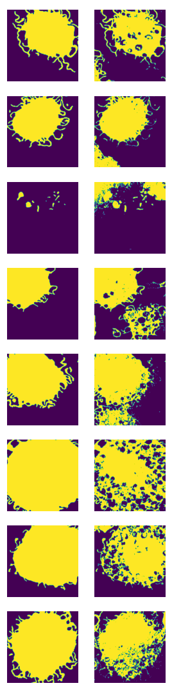
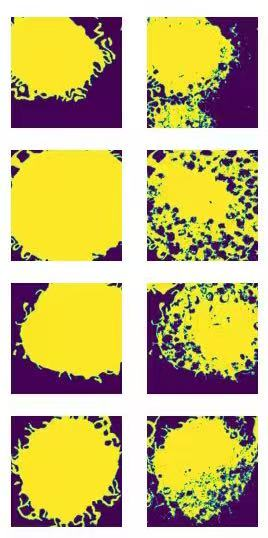
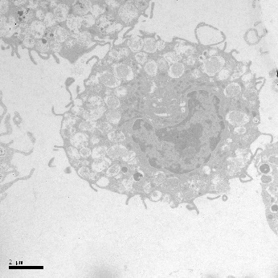
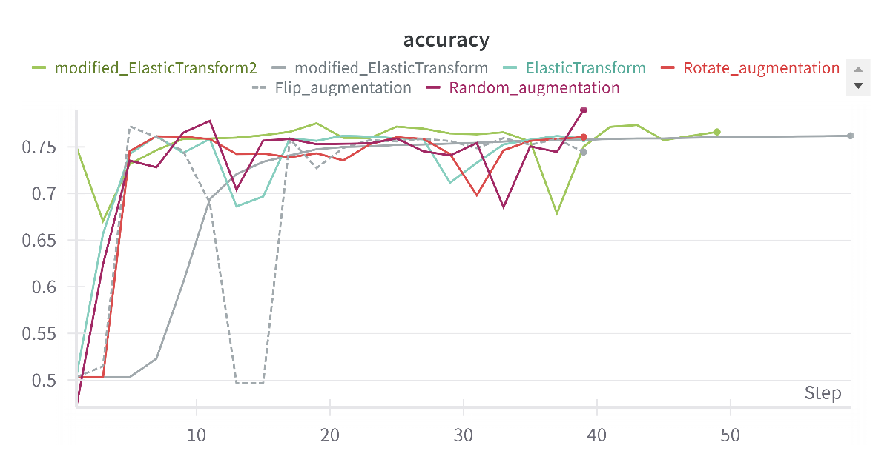
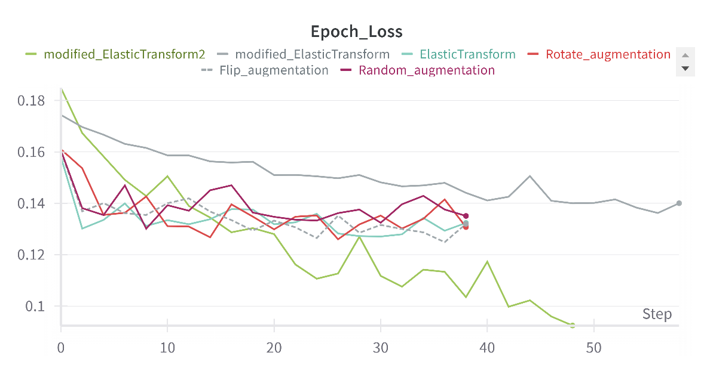

# Cell Image Segmentation

A PyTorch-based semantic segmentation project for grayscale microscopy cell images. The project implements a U-Net model for foreground/background segmentation and includes data loading, preprocessing, augmentation, training, experiment reports, and selected result figures extracted from the report.

|  |  |
| --- | --- |

## Highlights

- Implements a classic U-Net encoder-decoder architecture with skip connections, transpose convolutions, batch normalization, ReLU activations, and dropout.
- Provides a custom PyTorch `Dataset` for grayscale cell images and paired segmentation masks from `scans/` and `labels/`.
- Applies data augmentation, including horizontal/vertical flipping, zooming, rotation, gamma correction, and elastic transformation.
- Adds histogram equalization in the dataloader to improve predictions on low-intensity cell images that previously produced blank masks.
- Logs training and validation metrics with Weights & Biases.

## Project Structure

```text
Cell-image-segmentation/
+-- README.md
+-- .gitignore
+-- Description.pdf              # Assignment/task description
+-- report.pdf                   # Final experiment report
+-- report.docx                  # Editable report source
+-- docs/
|   +-- images/                  # Figures used in this README
|       +-- accuracy-comparison.png
|       +-- epoch-loss-comparison.png
|       +-- qualitative-results.png
|       +-- sample-cell.jpeg
+-- materials/
    +-- assignment_2.ipynb       # Notebook version of the experiment
    +-- README.txt               # Original brief project notes
    +-- data/
    |   +-- cells/
    |       +-- scans/           # Input cell images
    |       +-- labels/          # Ground-truth segmentation masks
    +-- src/
        +-- dataloader.py        # Data loading, preprocessing, and augmentation
        +-- model.py             # U-Net model definition
        +-- train.py             # Training, validation, and visualization script
        +-- requirements.txt     # Python dependencies
        +-- run.sh               # Linux/macOS shell runner
```

> The current repository also contains local training artifacts such as a virtual environment, W&B logs, `__pycache__`, and checkpoints. The new `.gitignore` excludes these files from future commits.

## Environment Setup

Python 3.9+ is recommended. On Windows PowerShell:

```powershell
cd materials/src
python -m venv .venv
.\.venv\Scripts\Activate.ps1
pip install -r requirements.txt
```

On Linux/macOS:

```bash
cd materials/src
python -m venv .venv
source .venv/bin/activate
pip install -r requirements.txt
```

If you want to use CUDA, install a PyTorch wheel that matches your local CUDA version. The current `requirements.txt` references `torch==2.5.1+cu118` and `torchvision==0.20.1+cu118`.

## Training

The training script uses relative paths, so run it from `materials/src`:

```bash
cd materials/src
python train.py
```

Default training settings are defined in [materials/src/train.py](materials/src/train.py):

- image size: `572`
- epochs: `25`
- DataLoader batch size: `4`
- optimizer: Adam in earlier epochs, then SGD
- scheduler: `StepLR(step_size=10, gamma=0.9)`
- loss: `CrossEntropyLoss`
- checkpoint path: `materials/src/checkpoint.pt`

To run W&B in offline mode:

```bash
wandb offline
python train.py
```

## Dataset

The dataset is stored in `materials/data/cells/`:

- `scans/`: 38 grayscale cell scan images
- `labels/`: 38 corresponding segmentation masks

`Cell_data` uses `train_test_split=0.8` by default and enables random augmentation for the training split.



## Model

The model is defined in [materials/src/model.py](materials/src/model.py). It follows the standard U-Net design:

- Contracting path: 4 downsampling steps, each with a two-convolution block and max pooling.
- Bottleneck: a 1024-channel two-convolution block.
- Expansive path: 4 upsampling steps using transpose convolutions and cropped skip connections from the encoder.
- Output layer: a `1x1` convolution that produces 2-class logits.

## Results

The best reported experiment uses random augmentation plus histogram equalization, together with Adam/SGD optimization, StepLR scheduling, and dropout. According to `report.docx`, the final pixel accuracy reached approximately **0.85663**, a clear improvement over the experiments without histogram equalization.





See [report.pdf](report.pdf) for full experiment details.
